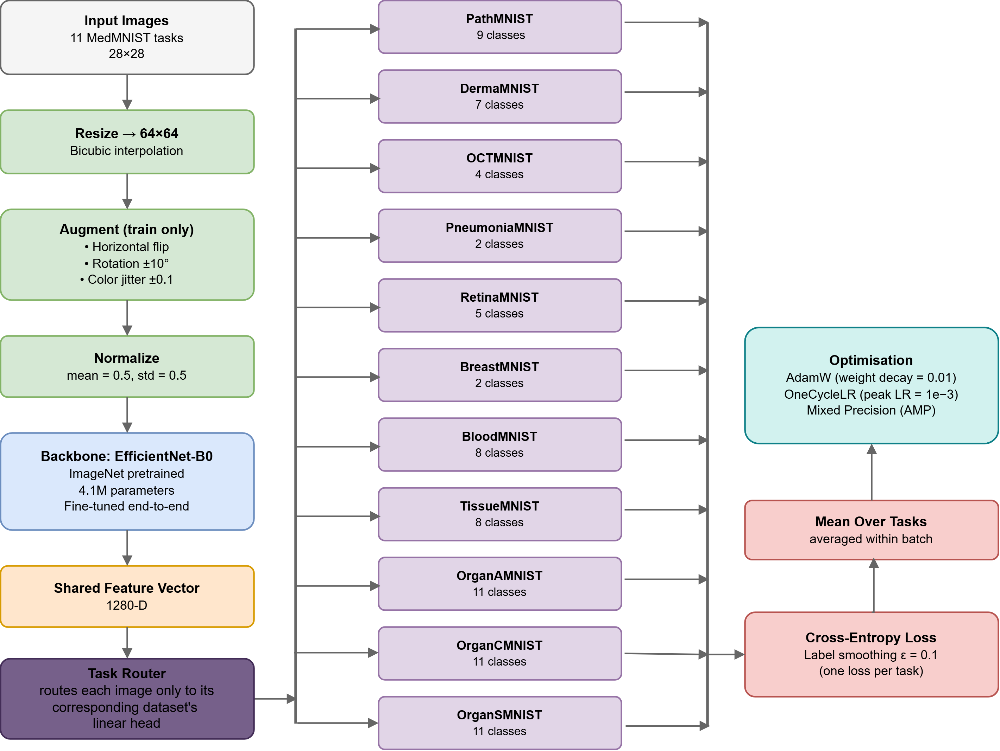

# A Shared-Backbone Approach for Multi-Task MedMNIST Classification

[](https://arxiv.org/abs/2609.06838)

**[SAIIT 2026](https://www.math.md/saiit2026/)** — International Conference on System Analysis & Intelligent Information Technologies, October 20–22, Chișinău, Moldova

Ștefan-Dorian Gavril · Andrei Arhire · Adrian Iftene  
Faculty of Computer Science, Alexandru Ioan Cuza University of Iași, Romania

---



PyTorch implementation for multi-task classification across 11 MedMNIST datasets using a shared convolutional backbone with task-specific linear heads, scored by harmonic mean of per-task macro-F1.

**Best result:** ConvNeXt-Tiny + label smoothing → **0.73294 harmonic-mean macro-F1** (6th place)

---

### Prerequisites

- Kaggle account with access to the [Tensor Reloaded competition](https://www.kaggle.com/competitions/tensor-reloaded-multi-task-med-mnist) data
- GPU with CUDA

### Running

All code is in `MedMNIST.ipynb`. Configure the experiment in cell 4:

```python
BACKBONE = "convnext_tiny"   # "convnext_tiny", "resnet18", "efficientnet_b0"
PRETRAINED = True
USE_WEIGHTED_SAMPLER = False
USE_LABEL_SMOOTHING = True
```

If running outside Kaggle, update `KAGGLE_DIR` in cell 7 to point to your local `.npz` files.

---

**Contact:** stefan.dorian.gavril@gmail.com
